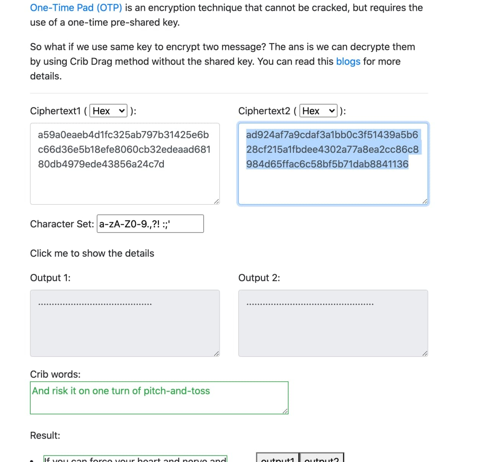

### Lab 2 report Afanasiuk IP-72

[Task link](https://docs.google.com/document/d/19vgZtvDN4_StEgVEM9MjfxnqfayByLNMD7PFJgvZv7c/edit)

[Service I used for decrypt](https://toolbox.lotusfa.com/crib_drag/)

Cipher text1:
a59a0eaeb4d1fc325ab797b31425e6bc66d36e5b18efe8060cb32edeaad68180db4979ede43856a24c7d

Cipher text2:
ad924af7a9cdaf3a1bb0c3f51439a5b628cf215a1fbdee4302a77a8ea2cc86c8984d65ffac6c58bf5b71dab8841136

Fistful we have to xor two ciphers texts. After that we can take one of most used words in english
and try to xor it starting with first char position, check if texts are readable and if it's not - continue.
If text seems to be readable we can enlarge that word to phrase and continue to xor unlit we will decrypt
whole text. 

I started trying worlds until I tried " once " and saw "for on" decrypted as well.
Then I just started increase my phrase char by char and got phrase which I could google and find the answer. 

#### Rudyard Kipling

